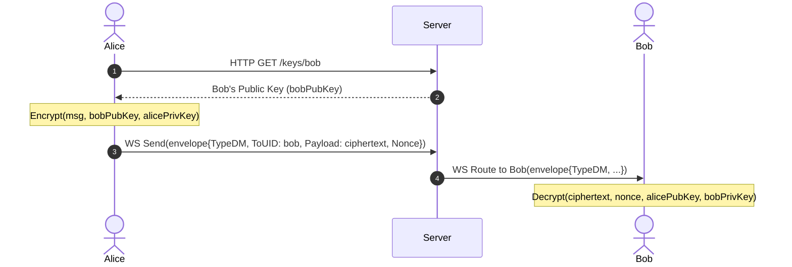
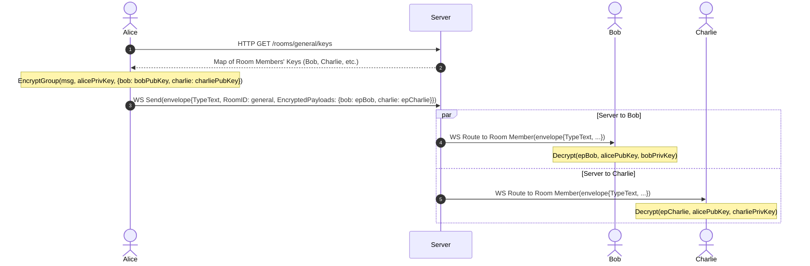

# Architecture

## Week 1: Hub and Pumps

### Hub Pattern (Single Goroutine)
The hub owns all room, client, presence, and pending-DM maps and runs them from a single goroutine. This keeps state transitions linear and avoids locks around shared maps, which reduces contention and prevents concurrent map writes. The hub is effectively the serialization point for room membership and broadcast fan-out.

### Channel Sizing Decisions
- `Client.send` is buffered at 256 messages. This is large enough to absorb short bursts (typing, reconnect snapshots, presence updates) without stalling writers, while still applying backpressure when a client falls behind.
- `Hub.broadcast` is buffered at 512 messages. This lets multiple producers (read pumps, presence updates) enqueue work without blocking during small spikes.

### Drop Policy (Backpressure)
When a `Client.send` channel is full, the hub drops the client from its room and closes the send channel. This is deliberate: it protects the hub from slow or stalled clients and keeps broadcast latency bounded for healthy clients.

### readPump + writePump Lifecycle

```text
Client connected
	|-- readPump goroutine starts
	|    |-- reads websocket frames
	|    |-- forwards messages to hub.broadcast
	|    `-- on ctx.Done or read error -> hub.unregister
	`-- writePump goroutine starts
			 |-- drains Client.send
			 |-- writes ping frames periodically
			 `-- on send close or write error -> exits

Hub.unregister
	|-- removes client from rooms
	|-- cancels client context
	`-- closes Client.send
```

### Benchmark (Hub Broadcast)
Run: `go test -bench=BenchmarkHubBroadcast -benchtime=5s ./internal/hub/`

Result (Intel(R) Core(TM) i5-8265U CPU @ 1.60GHz):

```text
BenchmarkHubBroadcast-8  4253254  1688 ns/op
```

Approx throughput: about 592k messages/second.

## Week 2: E2E Group Encryption

### Strategy Decision: Strategy A vs Strategy B
For E2E group encryption, two strategies were considered:
- **Strategy A (Per-recipient Encryption)**: The sender encrypts the message payload separately for each member of the room using pairwise Diffie-Hellman keys (via `nacl/box`). The outgoing `Envelope` carries a map of recipient UIDs to their corresponding ciphertext and nonce.
- **Strategy B (Symmetric Sender Keys)**: The sender generates a single symmetric room key, encrypts the message payload once with this key, and encrypts this symmetric key once for each room member. This is similar to the Signal Sender Keys protocol.

#### Scalability vs Simplicity
- **Strategy B** is significantly better at scale. For a room of size $N$, Strategy A requires $N$ public-key encryptions per message send, resulting in $O(N)$ CPU and bandwidth overhead for the client. Strategy B reduces the message payload overhead to $O(1)$ symmetric encryption, with a one-time key distribution overhead of $O(N)$ asymmetric encryptions.
- **Strategy A** was chosen for the first implementation because of its correctness guarantees and simplicity. It avoids the complexity of symmetric key generation, rotation, tracking membership changes (joins/leaves), and out-of-band key distribution. Verification of correctness is straightforward because each payload is mapped directly to standard pairwise E2E DMs.

### E2E Encryption Sequence Diagrams

#### Direct Message (DM) Encryption Flow
This diagram illustrates how Alice encrypts a DM for Bob and sends it via the Server.



#### Group Chat Fan-out Flow (Strategy A)
This diagram illustrates how Alice encrypts a group message separately for Bob and Charlie (room members) and fans out the payload through the Server.



